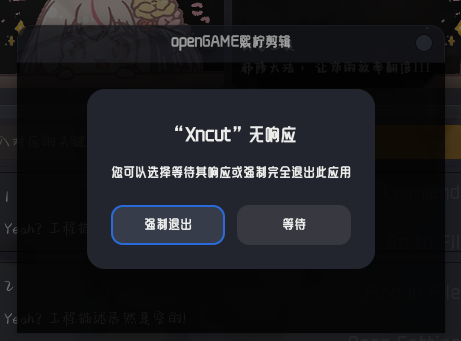

<!--
 * @Author: xixi_
 * @Date: 2026-03-10 20:07:19
 * @LastEditors: xixi_
 * @LastEditTime: 2026-05-16 21:01:49
 * @FilePath: /Xncut-Design/Md/11.BackgroundTask.md
 * Copyright (c) 2020-2026 by xixi_ , All Rights Reserved.
-->

# 后台任务
> 后台任务是最为棘手的实现, 这个不像前端那样的方便, 在实现过程中还要注意线程安全, 这是非常重要的

# 为什么需要
- 场景1: 执行非常耗时的任务时, 避免页面卡成翔, 被冻结, 就像这样:
  
    

- 场景2: 带GUI的录音功能

# 如何实现
> 方式很多, 可以类比为"回"字有四种写法: 回、囘、囬、𡇌(外口内目), 用在实现多线程上同理: 
- 经典线程实现, **QThread**
- 高级并发API, **QtConcurrent**
- 直接扔进线程池里, **QThreadPool**
- QT官方推荐, **QObject::moveToThread**

# 最难的地方
- 柔性退出(i.e., 安全退出)无任何残留, 内存泄漏

# 具体的代码
- 不知道. 事实上, 您可以在互联网上搜索到, 还有各种AI.
- 或者可以参考我们的开源例子.