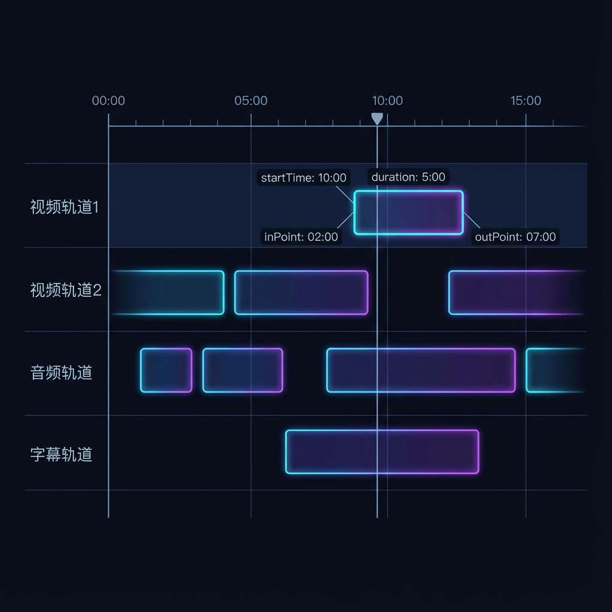
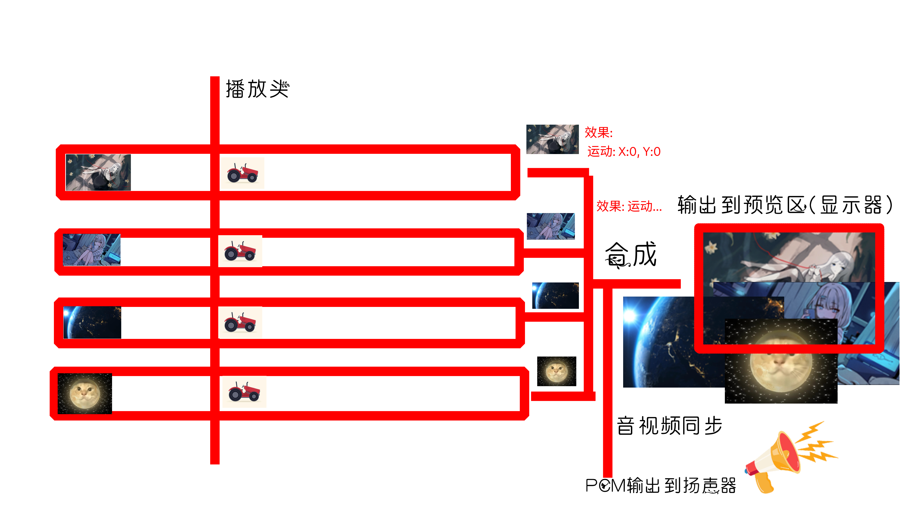

<!--
 * @Author: xixi_
 * @Date: 2026-02-04 21:15:21
 * @LastEditors: xixi_
 * @LastEditTime: 2026-02-08 21:02:59
 * @FilePath: /Xncut-Design/Md/2.OverviewPrinciples.md
 * Copyright (c) 2020-2026 by xixi_ , All Rights Reserved.
-->

# NLE软件的原理概述

# 时间线
> 最核心的模块, 时间线是由若干的轨道组成, 每一条轨道都是有若干个小片段组成

# 原理概述
1. 逐一seek单个轨道
2. 经过处理后并输出缓冲区
3. **画面**就输出到**屏幕**, 最常见的画面像素格式一般是**YUV420P**和**RGBA32**, **PCM**就输出到**扬声器**

啊啊啊, 我很难用文字去描述出来, 还是看图:

