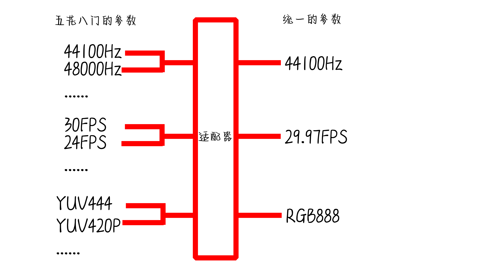

<!--
 * @Author: xixi_
 * @Date: 2026-02-09 11:55:21
 * @LastEditors: xixi_
 * @LastEditTime: 2026-02-09 15:18:42
 * @FilePath: /Xncut-Design/Md/3.DataMixed.md
 * Copyright (c) 2020-2026 by xixi_ , All Rights Reserved.
-->

# 数据混合
> 这个问题稍微很简单

# PCM混合
> 本质上就是采样点直接相加, 但是用户导入的格式那可是五花八门的啊, 啥样的都有, 问题也随之而来了: 
- 多个音频的采样率不一样 44100Hz, 48000Hz...
- 多个音频的格式不一样 S16LE, S24LE ...
- 多个音频的速度不一样 1.1x 11.45x ...
> 这些都问题, 我们需要逐一的去解决, 值得兴奋的是, 都有一个全局统一的参数, 这就是工程的配置, 就像是适配器, 如图

# 画面叠加
> 画面的叠加时RGB绝对不能直接相加的, 需要一些数学公式去实现, 同样, 问题也会有的: 
- 输入的色彩空间不一样 sRGB/BT.709 BT709/REC709 ...
- 输入的格式不一样 YUV420P, YUV444, YUV422, RGBA, RGB...

比如RGB的混合公式: 
$$
A = [0.0, 1.0] \\
R = round(R_1 - (R_1 - R_2) \cdot (1 - A)) \\
G = round(G_1 - (G_1 - G_2) \cdot (1 - A)) \\
B = round(B_1 - (B_1 - B_2) \cdot (1 - A))
$$