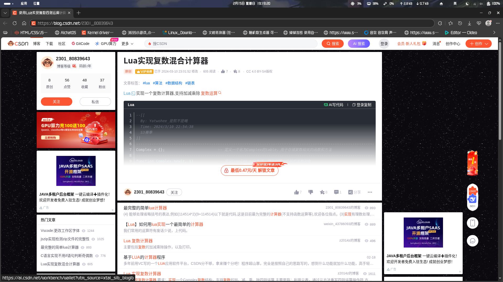
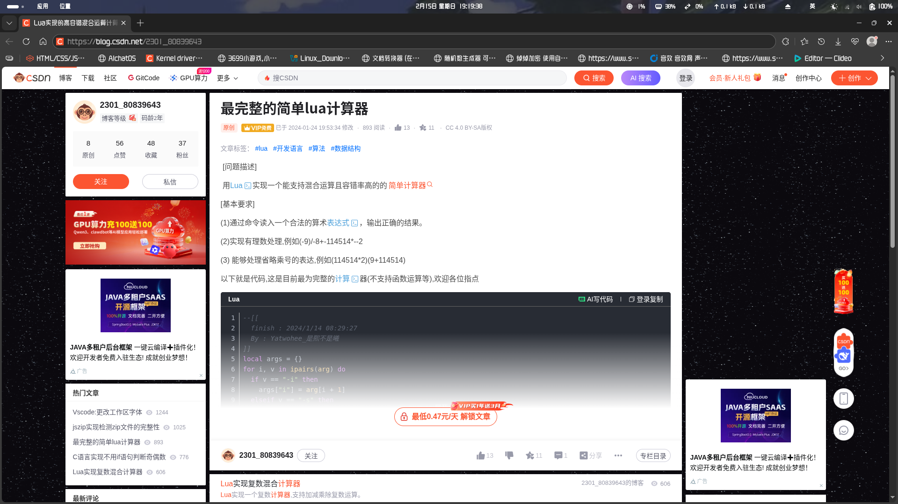

<!--
 * @Author: xixi_
 * @Date: 2026-02-15 18:58:53
 * @LastEditors: xixi_
 * @LastEditTime: 2026-02-15 19:23:15
 * @FilePath: /Xncut-Design/Md/5.BriefDiscussionLogin.md
 * Copyright (c) 2020-2026 by xixi_ , All Rights Reserved.
-->

# 浅谈登录
**作者: xixi_ 审核:xixi_**

**编写时间: 2026-02-15 18:58:53**

**最后的更改: 2026-02-15 19:06:56**

# 登录[复制&展开评论&看全文]

- 个人认为, 那都是很无聊的方法和手段, 因为这都不是真正的用户, 纯粹就是为了复制或者看看评论区, 顶多就是: 「登录完-拿到我想要的-就走人」,三步走完, 不会生产内容, 也不会活跃的, 纯粹就是**一次性的僵尸用户**, 还占用服务器的资源.
- 只有让用户去主动的认可你, 这才是真正的用户, 用这种手段取得的用户, 就不是真的
- **GitHub也没有不登录就不准你克隆仓库的限制**, **GitCode**和**CSDN**就是垃圾! 屎! Shit! 操你妈的! **Copy Steal and pay-Download Net!** 老子是绝对不会将任何东西放到**CSDN**

# 淘汰回放!

我之前写的啊!!!!!!! 我太后悔了! 我太该死了! 哦天哪!

**熙柠剪辑**也绝对不会这样设计的, 真搞不懂我自己.