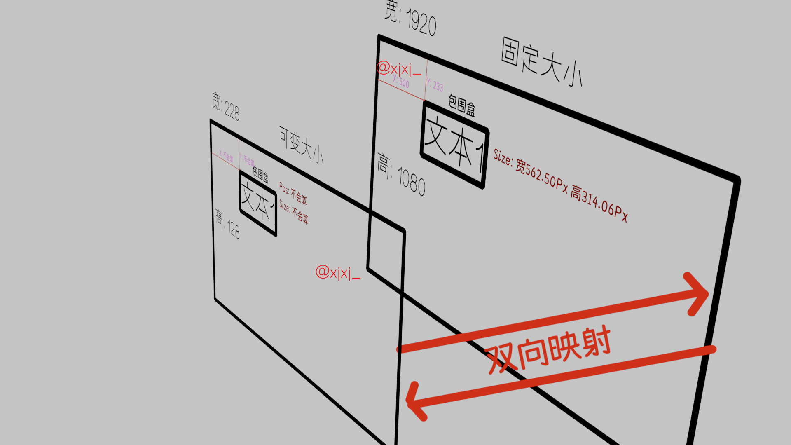

<!--
 * @Author: xixi_
 * @Date: 2026-03-02 13:01:50
 * @LastEditors: xixi_
 * @LastEditTime: 2026-03-02 16:14:04
 * @FilePath: /Xncut-Design/Md/7.PlayerElementDoubleMap.md
 * Copyright (c) 2020-2026 by xixi_ , All Rights Reserved.
-->

# 播放器的元素映射
> 脑子一抽想出来是不是这个原理, 然后稍微研究一下, 还真是这个原理, 图如下:

> 正如上述, 播放器中的所有元素都是映射到小窗口里的, 工程分辨率是相对保持不变的, 但是播放器的窗口是频繁变化的, 所以需要实时计算并调节小窗口里元素的参数, 同时导出的效果还能与播放器预览的一模一样

# 核心公式
- 不知道