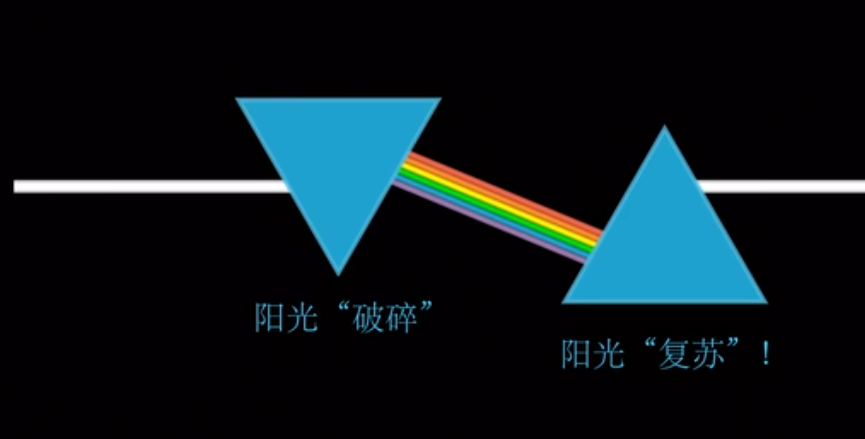

<!--
 * @Author: xixi_
 * @Date: 2026-03-05 13:09:52
 * @LastEditors: xixi_
 * @LastEditTime: 2026-03-06 09:35:29
 * @FilePath: /Xncut-Design/Md/8.FourierTransform.md
 * Copyright (c) 2020-2026 by xixi_ , All Rights Reserved.
-->

# 傅里叶变换
**作者: xixi_ 审核:xixi_** \
**编写时间: 2026-03-05 13:09:52** \
**最后的更改: 2026-03-05 17:20:20**

> 改变世界的伟大算法之一, 上帝的指纹

# 到底变了什么? 
> 从A变成了B, B也能变成A, 下图可以很好的解释:

# 正变换
$$
% 1.正向傅里叶变换
\begin{equation}
F(\omega) = \int_{-\infty}^{+\infty} f(t) \cdot e^{-j\omega t}dt
\end{equation}
$$

| 符号             | 是什么?                              |
| ---------------- | ------------------------------------ |
| $f(t)$           | 时间域信号(波形)                     |
| $F(\omega)$      | 频率域结果(频谱)                     |
| $e^{-j\omega t}$ | 一个旋转复数的探针, 对应频率$\omega$ |
| $\int... dt$     | 把整段时间的贡献累加起来             |

# 反变换
$$
% 2.反向傅里叶变换
\begin{equation}
f(t) = \frac{1}{2\pi} \int_{-\infty}^{\infty} F(\omega) \cdot e^{j\omega t} d\omega
\end{equation}
$$

事实上, 我无需手搓一个, 因为前人已经实现好了, 比如`fftw3`和`ffmpeg`

# 其他:
$$
A\sin(\omega t - \phi)
$$
其中, $A$表示了信号的强度(波的高度), $\omega$表示频率(波的步幅), $\phi$代表了偏移(波的位置), 用偏移这个词对我来说很好理解

<!-- > 不仅局限于这两个, 形态还是很多的

- 拉普拉斯变换: 傅里叶变换的泛化:
$$
F(s) = \mathscr{L}[f(t)] = \int_0^{+\infty}f(t) e^{-st}dt 
$$ -->
