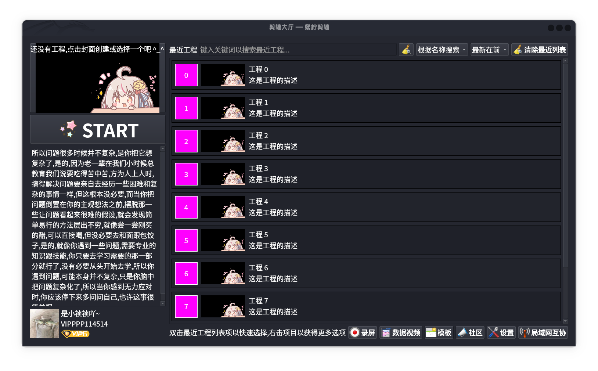

<!--
 * @Author: xixi_
 * @Date: 2025-04-22 18:18:18
 * @LastEditors: xixi_
 * @LastEditTime: 2025-07-06 17:45:08
 * @FilePath: /Xncut/README.md
 * Copyright (c) 2020-2025 by xixi_ , All Rights Reserved.
-->

# **熙柠剪辑: QT基岩版**
# 禁止商用! 
# 禁止商用! 
# 禁止商用! 
# 禁止商用! 
# 商用者生孩子没皮燕!

# 你可以:
1. **学习**或者拿来当**教学材料**都可以
2. 二次开发时需要标注**基于熙柠剪辑**
3. 在非盈利性质的项目中使用，帮助他人理解或分享
4. 与朋友、同事共享，但仅限于**非商用**的场景
5. 在自己的博客、论坛、社交平台分享，但不得以**盈利**为目的
# 你不可以,包括但不限于: 
1. 挂到**闲鱼等电商平台**上贩卖,老子最讨厌**二手码贩子**了
2. 将其作为产品的一部分进行商业化或变现
3. 修改后用于盈利、广告宣传等商业活动
4. 分发给不符合授权条件的人或组织
5. 声称为自己的原创作品，未经许可进行再分发或出售

# 简介
> 这是小妤的初中到高中作品, 纯前端, 经历了多次重构, 希望你喜欢^_^ 
> 熙柠剪辑经过了很多次深度调优, 致力于提供**更低的内存占用**、**更快的剪辑速度**和**更专业的剪辑方案**~ 
> 我们的目标是向企业级,系统级看齐; 做到和剪映,Pr一样的规模 
> **C/C++**是很漂亮的语言, 人菜就是人菜, 人菜不要责怪工具
> 喜欢的伙计记得点个Star~

# 项目类型
面向`Linux`的非线性(NLE)混合剪辑软件

# 面向用户
仅面向Unix/类Unix操作系统的C端用户,后续面向B端

# 关于跨平台
1. 本项目不跨平台,因为本项目就是在Linux环境下解决使用类剪映软件的方案
2. 如果在Windows和Mac OS或者移动端下发布,就会显得多余,这些平台上有很多解决方案

# 各种版本: 
- WEB版最早创建于: 2022年4月
- LUA版最早创建于: 作者也不知道
- Unity引擎版最早创建于: 作者也不知道
- OpenGL版最早创建于: 作者也不知道
- 虚幻引擎版最早创建于: 作者也不知道
- QT版最早创建于2024年7月8日 下午 08∶47∶56

# ............ 
2025年1月26日 上午 09:32:00,又一次重构这个项目,这个日子是2025年第一场雪,好吧,这已经重构第5次重构了........

# 核心模块
> 主要分为四个核心模块
1. 大厅
2. 工程管理
3. 编辑器
4. 设置

# 项目文件(夹)结构
- 根目录
  - [DIR] Assets **资源目录**
    - [DIR] Images **图片**
      - [DIR] ClipHall **剪辑大厅**
        - [DIR] BottomMenu **底部菜单**
        - [FILE] XHeadImg.png **用户默认头像**
      - [DIR] Public **公共的图片资源**
    - [FILE] ClipHall.qrc **大厅资源文件**
    - [FILE] Public.qrc **公共的资源文件**
  - [DIR] Src **假的目录,嘿嘿**
  - [DIR] Xncut **真正的源代码目录**
    - [DIR] XncutClipHall **剪辑大厅**
      - [FILE] XncutClipHallWidget.h **主部件**
      - [FILE] XncutClipHallWidget.cpp
      - [FILE] XncutRecentProjectCardDelegate.h **最近工程卡片委托**
      - [FILE] XncutRecentProjectCardDelegate.cpp
      - [FILE] XncutUserInfoWidget.h **用户信息(实际上是布局)**
      - [FILE] XncutUserInfoWidget.cpp
    - [DIR] XncutCore **一些核心组件**
      - [FILE] XncutRunTimeContext.h **熙柠剪辑运行时上下文**
      - [FILE] XncutRunTimeContext.cpp
      - [FILE] XncutFunTool.h **常用的函数,类似于std::max这样的(保留类)**
      - [FILE] XncutFunTool.cpp
    - [DIR] XncutPublicWidget **公共的部件**
      - [FILE] XncutListView.h **列表视图**
      - [FILE] XncutListView.cpp
    - [DIR] XncutWelcome **欢迎**
      - [FILE] XncutWelcomeScreen.h **欢迎屏幕**
      - [FILE] XncutWelcomeScreen.cpp
    - [FILE] Main.cpp **入口**
    - [FILE] Xncut.h **主窗口**
    - [FILE] Xncut.cpp
  - [DIR] Data **一些配置**
  - [DIR] Doc **开发文档**
  - [DIR] Test **测试例子**
  - [FILE] CMakeLists.txt **Cmake的构建配置**
  - [FILE] README.md **就是这个**

# 更新日志
- 2025-06-28 18:22:28 (优化排版): 简化编辑器内部的关于信息对话框,去掉冗余信息
- 2025-06-28 00:08:18 (优化视觉): 通过QTextOption类,绘制文本时,可以完美垂直居中
- 2025-06-27 23:55:19 (优化视觉): TAB选中时文本加粗(PS: 这个设计借鉴了百度贴吧)
- 2025-06-27 23:03:19 (优化视觉): 使用GroupBox来优化创建工程节目的视觉效果
- 2025-06-26 20:13:22 (新功能): 轨道头主菜单新增`小轨道`动作
- 2025-06-05 19:27:13 (架构优化): 将类`XncutLocalAreaNetCollaborationWidget`改为`XncutAreaNetCollWidget`
- 2025-06-23 00:17:48 (新功能): 大厅最近工程界面加入皮筋框
- 2025-06-05 22:38:12 (代码优化): 将部分初始化按钮代码封装成函数,以减少冗余代码
- 2025-05-24 15:05:54 (代码优化): 通过TabWidget的setStyle方法,去掉大量冗余代码,只需修改一次,使用了该样式的TabWidget都改变
- 2025-05-21 22:56:52 (修复BUG): 修复了第6版时间线严重影响用户体验的BUG(剪辑移动时可以多选以及会弹出右键菜单)

# 各板块性能
1. **剪辑大厅**
  - [最近工程列表(性能瓶颈)] 一百万数据,搜索时界面会卡死,需要很长时间显示搜索的结果
2. **工程管理器**
3. **编辑器**

# 骚操作
1. (X + Y - 1) / Y **向上取整**
2. (X + 5) / 10 **四舍五入**

# 贡献

| 贡献者          | 控件                            |
| --------------- | ------------------------------- |
| 飞扬青云        | 开关按钮控件                    |
| 友善啊，朋友    | 标尺控件                        |
| weixin_44480265 | 峰值表控件                      |
| B站网友         | 消息框                          |
| china丶龙少     | Qt 自定义控件 标尺控件 QLsRuler |

# 使用的开源项目
| 项目名   | 协议          |
| -------- | ------------- |
| Qt       | LGPL v3       |
| FFMpeg   | LGPL v2.1+    |
| cJSON    | MIT           |
| STB      | MIT           |
| OpenCV   | Apache 2.0    |
| OpenGL   |               |
| MidiFile | MIT           |
| SDL      | zlib          |
| SQLite   | Public Domain |
| TinyExpr | MIT           |

# 参考的开源项目
| 项目名      | 描述                     | 传送门                                                            | 协议      |
| ----------- | ------------------------ | ----------------------------------------------------------------- | --------- |
| MLT         | 多媒体框架，支持视频编辑 | [MLT GitHub](https://github.com/mltframework/mlt)                 | GPLv3     |
| libopenshot | 一个用于视频编辑的C++库  | [libopenshot GitHub](https://github.com/MLTFramework/libopenshot) | GPLv3     |
| ShotCut     | 开源视频编辑器           | [Shotcut官网](https://shotcut.org/)                               | GPLv3     |
| Olive       | 开源视频编辑器           | [Olive官网](https://www.olivevideoeditor.org/)                    | GPLv3     |
| OpenShot    | 开源视频编辑器           | [OpenShot官网](https://www.openshot.org/)                         | GPLv3     |
| pitivi      | 开源视频编辑器           | [pitivi官网](https://www.pitivi.org/)                             | LGPL v2.1 |
| TimeLine    | 时间线插件               |                                                                   |           |
| CcClip      | WEB端视频编辑器          |                                                                   |           |
| fly-cut     | WEB端视频编辑器          |                                                                   |           |
| Cliput      | B站网友提供的视频编辑器  |                                                                   |           |
| WebAv       |                          |                                                                   |           |
| frei0r      | 视频效果插件库           | [frei0r官网](http://frei0r.dyne.org/)                             | LGPLv2.1  |
| kdenlive    | 开源视频编辑器           | [Kdenlive官网](https://kdenlive.org/)                             | GPLv3     |

# 参考的软件
## 主要参考UI和行为设计以及部分开源项目的源代码
| 软件名称                         | 有价值的参考点                            |
| -------------------------------- | ----------------------------------------- |
| 万祯云剪                         |                                           |
| 剪映                             | 复合片段(在PR称为嵌套) 工程的存储方式     |
| 和平精英                         | 大厅布局                                  |
| 必剪                             | 素材库和一键三连                          |
| 万兴喵影                         | 全选del清除空白                           |
| 快影                             | 花字                                      |
| 抖影视频剪辑                     |                                           |
| 爱拍剪辑                         | 涂鸦板                                    |
| 福昕视频剪辑                     | 超大分辨率处理                            |
| 初中英语听力口语考试纲要全真模拟 |                                           |
| 剪辑魔法师                       | 流畅放8K                                  |
| EV剪辑                           |                                           |
| 爱剪辑                           |                                           |
| 影忆                             |                                           |
| 不咕剪辑                         |                                           |
| 风云视频剪辑王                   |                                           |
| 数码大师旗舰版                   |                                           |
| 快剪辑                           |                                           |
| 格式工厂                         |                                           |
| 昆冈剪辑                         | 效果管理方式,通过提取码来获取             |
| 威力导演                         |                                           |
| WPS                              | PPT的切换和动画                           |
| VScode                           | 超大文件读取策略                          |
| 达芬奇                           | 蜘蛛网(颜色扭曲器)                        |
| After Effects CS4                | 命名方式,例如变速称为时间伸缩             |
| Adobe Premiere Pro               | 钢笔工具 效果面板 关键帧面板              |
| OpenShot                         |                                           |
| ShotCut                          | 流畅放8K 混合轨道设计 富文本 直接显示HTML |
| Olive                            | 节点编辑(达芬奇也有)                      |
| kdenlive                         |                                           |
| flowblade                        |                                           |