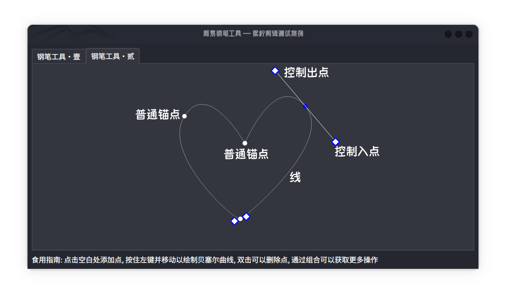
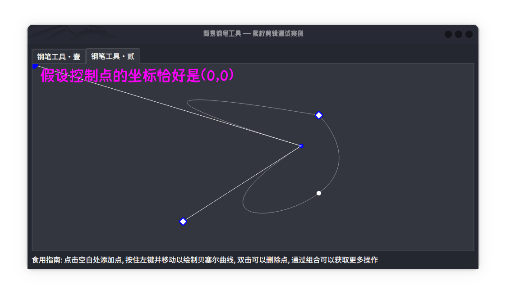
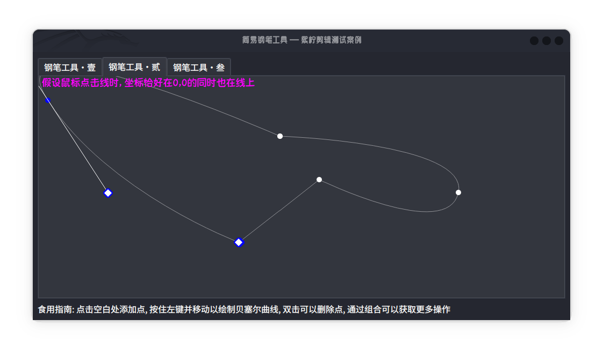

<!--
 * @Author: xixi_
 * @Date: 2025-09-18 20:18:07
 * @LastEditors: xixi_
 * @LastEditTime: 2025-10-31 22:01:22
 * @FilePath: /XncutUI/Test/XncutPenTool/README.md
 * Copyright (c) 2020-2025 by xixi_ , All Rights Reserved.
-->

# 钢笔工具
> 使用C++手搓的钢笔工具

# 项目结构
- 根目录
  - [DIR] XncutPenTool **钢笔工具**
    - [DIR] XncutPenToolCoreWidget **核心部件**
      - [FILE] XncutPenToolWidget.h **第一代钢笔工具**
      - [FILE] XncutPenToolWidget.cpp
      - [FILE] XncutPenToolWidget2.h **第二代钢笔工具**
      - [FILE] XncutPenToolWidget2.cpp
      - [FILE] XncutPenToolWidget3.h **第三代钢笔工具**
      - [FILE] XncutPenToolWidget3.cpp
    - [FILE] Main.cpp **入口**
    - [FILE] MainWindow.h **主窗口**
    - [FILE] MainWindow.cpp
  - [FILE] CMakeLists.txt **CMake**
  - [FILE] README.md **就是这个**

# 第一代, 第二代和第三代的区别
1. 性能
2. 外观
3. 代码质量
4. 操作方式
5. 曲线拟合(仅第三代有这个功能)

# 需要实现的功能
- 总体是增删改查
1. 增: 
   - 增加锚点
2. 删: 
   - 删除锚点
3. 改: 
   - 修改锚点位置
   - 控制点位置
   - 一些标志位
4. 查
  - 查询鼠标下Item的类型

# 接下来, 请看下面的解释
1. 我定义了这些类型, 一共有5个, 在代码里有对应的枚举, 它们分别是: 
   -  空类型(NULL)
   -  普通的锚点(Anchor point)
   -  控制入点(Control in point)
   -  控制出点(Control out point)
   -  线段(Segment)
   

2. 当我们知道一些规则时, 实现起来是相对轻松的, 钢笔工具规则如下: 
   - 只有两种线, **直线**与**三次贝塞尔曲线**
   - 普通锚点的外观是圆形, 控制点的外观是菱形
   - 点务必是按照**顺序存储**的, 换句话来讲, 这些点的存储方式是用一种线性的数据结构来存储的
   - 一切的点是可以通过鼠标移动和选择(通过鼠标指针单击这个点以选择)
   - 当鼠标指针点击画布的空白时, 在没有闭合路径的情况下, 无论如何应该在容器中追加点
   - 当鼠标指针按下并移动时, 两个控制点会形成镜像
   - 当路径没有闭合时, 移动鼠标时应该绘制预览线
   - 当鼠标指针点击第一个普通锚点时, 而且至少两个点(都是贝塞尔曲线)时或者三个点(都是直线时)时应该闭合路径
   - 当鼠标指针双击普通锚点时应该从容器中删除点
   - 当任意控制点通过ALT调节时, 两个控制点都会退化为普通的锚点(NB! 仅具有普通锚点的可任意移动的性质)
   - 当鼠标指针点击线时应该在两点之间添加点

3. 点该如何定义? 所以一个点的结构体如下:
```cpp
    typedef struct
    {
        QPoint Point;           /* 点 */
        QPoint ControlInPoint;  /* 控制入点 */
        QPoint ControlOutPoint; /* 控制出点 */
        bool IsAltAdjust;       /* 是否通过ALT移动了控制点,如果为true, 两个控制点都退化为普通的锚点 */
        int Index;              /* 索引(保留, 并没有使用) */
    } XncutPenPoint;
```
   - 特别是**IsAltAdjust**字段, 它记录了是否通过ALT来调整控制点
   - 还有一个**Index**作为性能优化字段, 但是并没有去使用它, 仅保留而已
   - 其余的三个字段(i,e,. **Point**,**ControlInPoint**和**ControlOutPoint**), 想必您非常明白, 这里就不进行过多的解释
   - 如您所见, 他们很容易的保存为JSON或者其他的格式, 比如XML

4. 为什么**ControlInPoint**和**ControlOutPoint**不能是**0,0**? 
   - **QPoint(0, 0).isNull()返回的是true**等价于**QPoint().isNull()返回true**, 这是非常重要的
   - 如果控制点**恰好**就在0,0坐标, 将会产生一些问题,比如下面的情况
   
   
   - 如上图所示, 这就是为什么不用**isNull**方法来判空的原因.

5. 点该如何存储? 
   - 我们发现, 这些点是**线性结构**
   - 我择了**QVector动态容器**来存储这些**点结构体**
